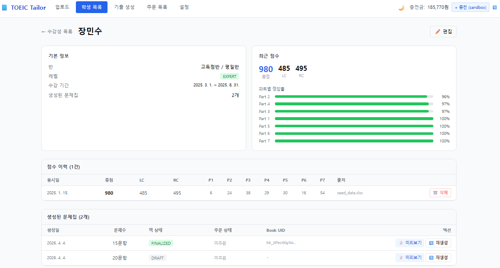
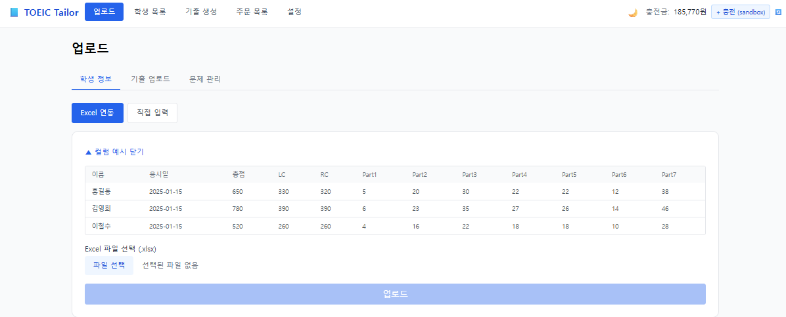
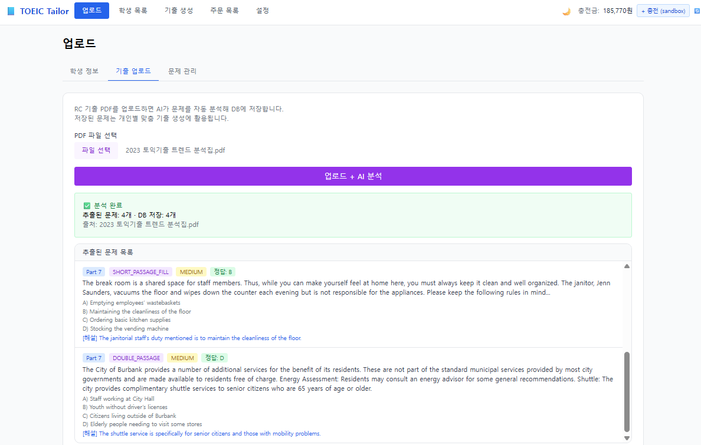
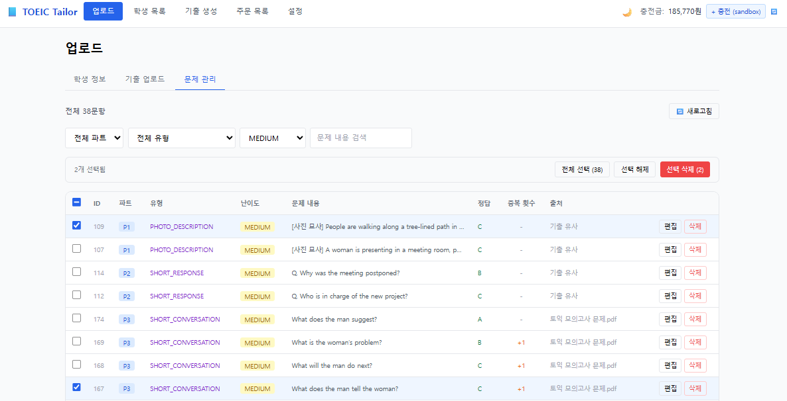
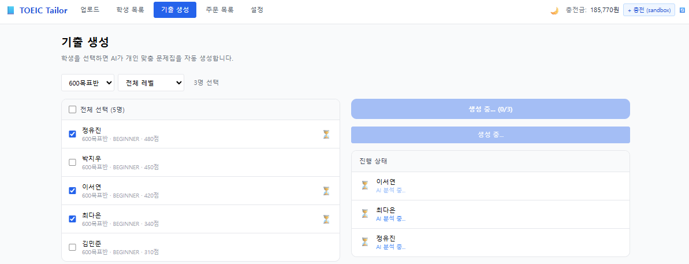
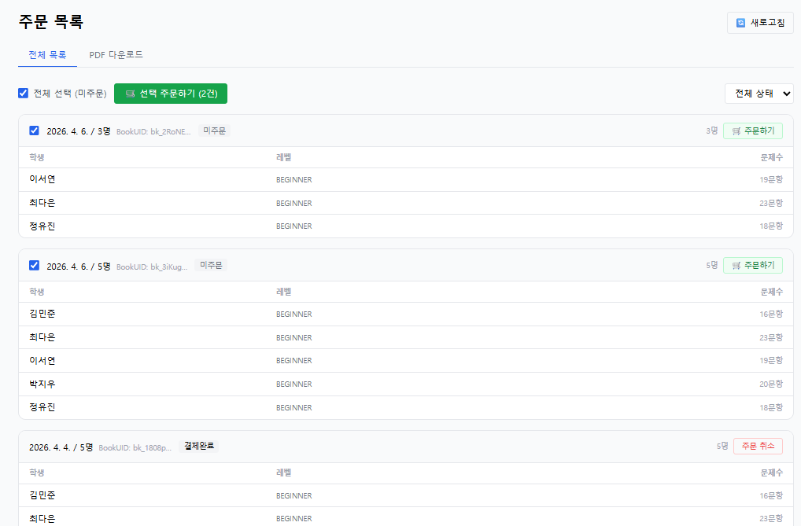
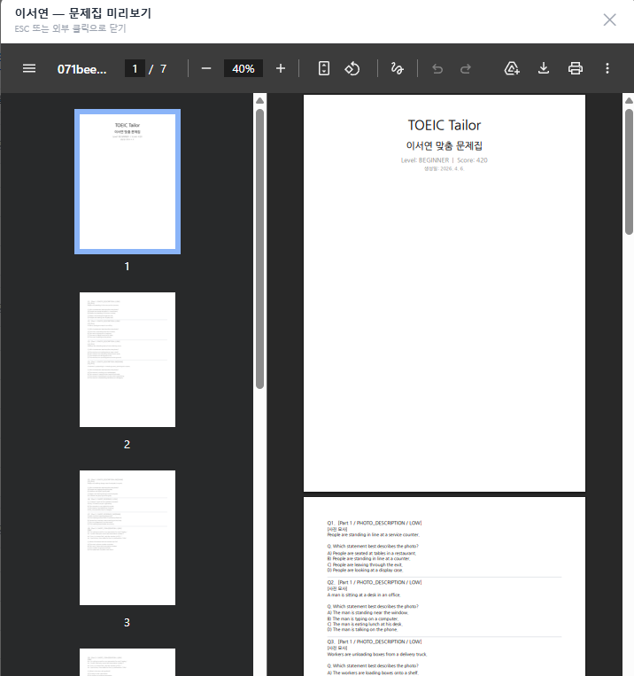
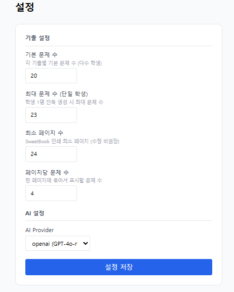

# 기능 가이드

각 페이지의 기능과 사용 방법을 설명합니다.

---

## 1. 학생 관리 (`/`)

<!-- 스크린샷 필요: 학생 목록 테이블 전체 화면. 파일명: dashboard-main.png -->

### 기능

- **학생 목록 테이블** — 이름, 반, 수업 유형, 레벨 뱃지, 최신 점수(총점/LC/RC), 취약 파트 Top 3, 문제집 수
- **필터** — 레벨, 반 이름, 수업 유형, 이름 검색 (URL 쿼리 파라미터로 반영)
- **페이지네이션** — 20건 단위, 하단 페이지 컨트롤
- **학생 추가** — 우상단 버튼 → 이름/반/날짜 입력 모달
- **편집** — 행 우측 편집 버튼 → 인라인 모달
- **삭제** — 행 삭제 버튼 → 확인 후 관련 데이터 cascade 삭제
- **학생명 클릭** → 학생 상세 페이지로 이동

### 레벨 뱃지 색상

| 레벨 | 색상 |
|------|------|
| BEGINNER | 회색 |
| INTERMEDIATE | 초록 |
| ADVANCED | 파랑 |
| EXPERT | 보라 |

---

## 2. 학생 상세 (`/students/:id`)

<!-- 스크린샷 필요: 학생 상세 페이지. 상단 정보 카드 + 취약파트 바 + 점수 이력 테이블. 파일명: student-detail.png -->

### 기능

- **기본 정보 카드** — 이름, 반, 레벨, 수강 등록/만료일, 총 문제집 수
- **점수 카드** — 최신 총점/LC/RC + 파트별 취약도 막대 (50% 미만 빨강, 70% 미만 노랑, 이상 초록)
- **점수 이력 테이블** — 응시일, 총점, LC, RC, 파트별 정답 수, 삭제 버튼
  - 삭제 시 남은 기록 중 최신 기준으로 레벨·점수 자동 재계산
- **문제집 목록** — 생성일, 문항 수, SweetBook 상태, PDF 미리보기 버튼, 재생성 버튼

---

## 3. 업로드 (`/upload`)

### 탭 1 — 학생 정보

<!-- 스크린샷 필요: 업로드 페이지 탭1, Excel 모드 + 미리보기 테이블 표시 상태. 파일명: upload-student.png -->

**Excel 연동 모드**
1. "▼ 컬럼 예시 보기" 버튼으로 필요한 컬럼 형식 확인
2. `.xlsx` 파일 선택 → 자동으로 파싱 + 미리보기 5행 표시
3. "업로드" 버튼 → 전체 데이터 저장, 결과(신규/갱신 수) 표시

**직접 입력 모드**
- 이름, 반, 수업 유형, LC/RC 점수, 파트별 정답 수 입력 후 저장

---

### 탭 2 — 기출 업로드

<!-- 스크린샷 필요: 업로드 탭2, PDF 업로드 후 추출된 문제 목록이 보이는 화면. 파일명: upload-exam.png -->

1. RC 기출 PDF 파일 선택
2. "업로드 + AI 분석" 클릭
3. AI(GPT-4o-mini 또는 mock)가 문제 추출 (수십 초 소요)
4. 추출된 문제 목록 확인 (파트/유형/난이도/정답/해설)
5. 결과: 추출 N개 · 저장 N개 · 중복 N개

> **팁:** `AI_PROVIDER=mock` 환경에서는 즉시 더미 문제가 반환됩니다.

---

### 탭 3 — 문제 관리

<!-- 스크린샷 필요: 업로드 탭3, 문제 테이블 + 체크박스 선택 + 선택 액션 바 표시 상태. 파일명: upload-questions.png -->

- **필터** — 파트, 유형, 난이도, 내용 검색
- **체크박스 선택** — 현재 페이지 전체 선택 (헤더 체크박스, indeterminate 지원), 전체 문제 선택, 선택 해제
- **일괄 삭제** — 선택한 문제 한 번에 삭제
- **인라인 편집** — 파트/유형/난이도/정답 수정 후 저장
- **중복 횟수** — 동일 문제가 여러 PDF에서 추출된 횟수 (오렌지색 표시)
- **반응형** — 모바일에서 ID·출처 컬럼 자동 숨김

---

## 4. 기출 생성 (`/generate`)

<!-- 스크린샷 필요: 생성 페이지, 좌측 학생 체크리스트 + 우측 실시간 진행 상태 패널. 파일명: generate.png -->

### 사용 방법

1. 반/레벨 필터로 대상 학생 좁히기
2. 체크박스로 학생 선택 (상단 체크박스로 전체 선택)
3. "선택한 N명 문제집 생성" 버튼 클릭
4. 실시간 진행 상태 확인 (⏳ 분석 중 → ✅ 완료 / ❌ 실패)
5. 완료 후 자동으로 주문 페이지(/orders)로 이동

### 문제 선별 로직

1. 학생의 최신 ScoreRecord에서 파트별 정답률 계산
2. 정답률이 낮은 파트 순으로 문제 할당
3. 취약 파트의 difficulty 맞춤 문제 후보 3배수 조회
4. Fisher-Yates 셔플 → 필요한 수만 추출 (매번 다른 문제)
5. 기본 20문제, 최대 23문제 (설정에서 변경 가능)

---

## 5. 주문 목록 (`/orders`)

<!-- 스크린샷 필요: 주문 목록 페이지, 주문 그룹 카드 + 학생 목록 + 상태 뱃지. 파일명: orders.png -->

<!-- 스크린샷 필요: PDF 인라인 뷰어 모달이 열린 상태 (문제집 PDF가 iframe에 표시됨). 파일명: pdf-preview.png -->

### 탭 1 — 주문 목록

- SweetBook에 발행된 문제집 목록 (bookUid 기준 그룹)
- 각 그룹에 속한 학생 이름 + 개별 문제집 상태
- **"주문"** 버튼 — 실물 인쇄 주문 (잔액 부족 시 자동 충전)
- **"취소"** 버튼 — 주문 취소 (사유 입력)
- **"주문 만들기"** — 선택한 workbook ID로 신규 주문

### 탭 2 — PDF 다운로드

- 주문 그룹별 또는 전체 목록으로 보기 전환
- **"👁 미리보기"** — 인라인 PDF 뷰어 모달 (ESC 또는 배경 클릭으로 닫기)
- **"⬇ PDF"** — 개별 PDF 다운로드
- **"ZIP 다운로드"** — 선택한 문제집 일괄 ZIP 다운로드

---

## 6. 설정 (`/settings`)

<!-- 스크린샷 필요: 설정 페이지 전체 화면 (문제 수 입력 필드 + AI 프로바이더 선택). 파일명: settings.png -->

| 설정 항목 | 설명 |
|-----------|------|
| 기본 문제 수 | 문제집 생성 시 기본으로 포함할 문제 수 |
| 최대 문제 수 | 문제집에 포함 가능한 최대 문제 수 |
| 최소 페이지 수 | SweetBook 최소 페이지 요건 (기본 24) |
| 페이지당 문제 수 | PDF 레이아웃 설정 |
| AI 프로바이더 | `mock` (API 키 불필요) 또는 `openai` |
| OpenAI API 키 | `openai` 선택 시 필요 |

설정 변경은 즉시 서버에 반영되며, DB에 저장되어 서버 재시작 후에도 유지됩니다.

---

## 공통 UI 요소

### 다크모드

- 우상단 🌙 / ☀️ 버튼으로 토글
- 설정은 `localStorage`에 저장되어 새로고침 후에도 유지

### Toast 알림

- 작업 성공/실패 시 우상단에 자동 표시 (3.5초 후 자동 사라짐)
- 초록: 성공, 빨강: 오류, 파랑: 정보

### 크레딧 위젯 (상단 네비게이션)

- SweetBook 잔액 실시간 표시
- "충전" 버튼 → 샌드박스 100,000원 즉시 충전
